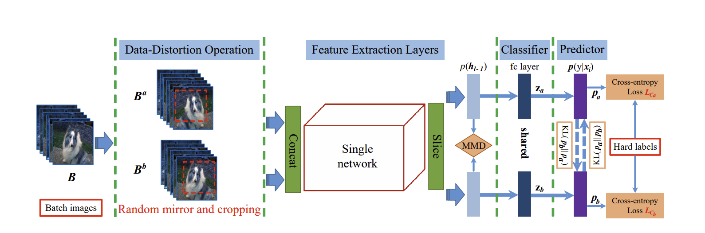

# Data-Distortion Guided Self-Distillation for Deep Neural Networks
Unofficial PyTorch Implementation of [Data-Distortion Guided Self-Distillation for Deep Neural Networks](https://ojs.aaai.org//index.php/AAAI/article/view/4498) (AAAI 2019)

## Overview



## Code Structure
```sh
src/
    └─ model/
        └─ net.py
    ├─ config.py
    ├─ dataset.py
    ├─ main.py
    ├─ trainer.py
    └─ utils.py
scripts/
    ├─ run_baseline.sh
    └─ run_ddgsd.sh
├─ .gitignore
├─ Dockerfile
├─ LICENSE
├─ README.md
└─ requirements.txt
```

## Dependencies
- torch==1.6.0
- torchvision==0.7.0

All dependencies are written in [requirements.txt](https://github.com/youngerous/ddgsd-pytorch/blob/main/requirements.txt), and you can also access through [Dockerfile](https://github.com/youngerous/ddgsd-pytorch/blob/main/Dockerfile).

## How to Run

### Baseline

```sh
$ sh scripts/run_baseline.sh
```

### DDGSD
```sh
$ sh scripts/run_ddgsd.sh
```

## Results

|  Dataset  |  Model   | Top-1 Error | Top-5 Error |  Method  |
| :-------: | :------: | :---------: | :---------: | :------: |
| CIFAR-100 | ResNet18 |   30.15%    |    9.58%    | Baseline |
| CIFAR-100 | ResNet18 | **26.60%**  |  **8.36%**  |  DDGSD   |

\* Hyperparameters of this implementation follow paper settings. <br>
\* MMD Loss is replaced with MSE Loss in this implementation. <br>
\* For another differences, check [this issue](https://github.com/youngerous/ddgsd-pytorch/issues/1).
